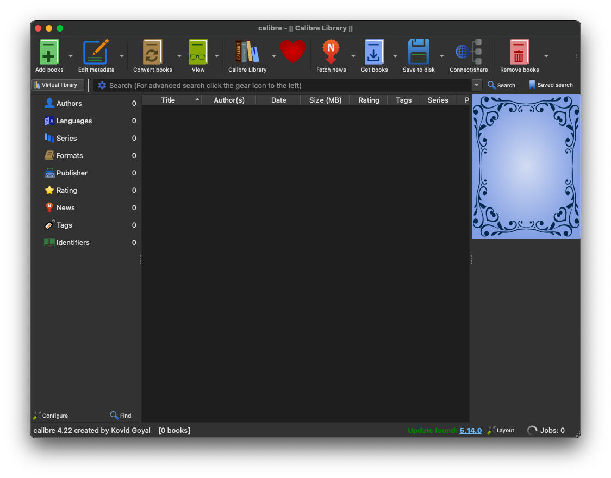
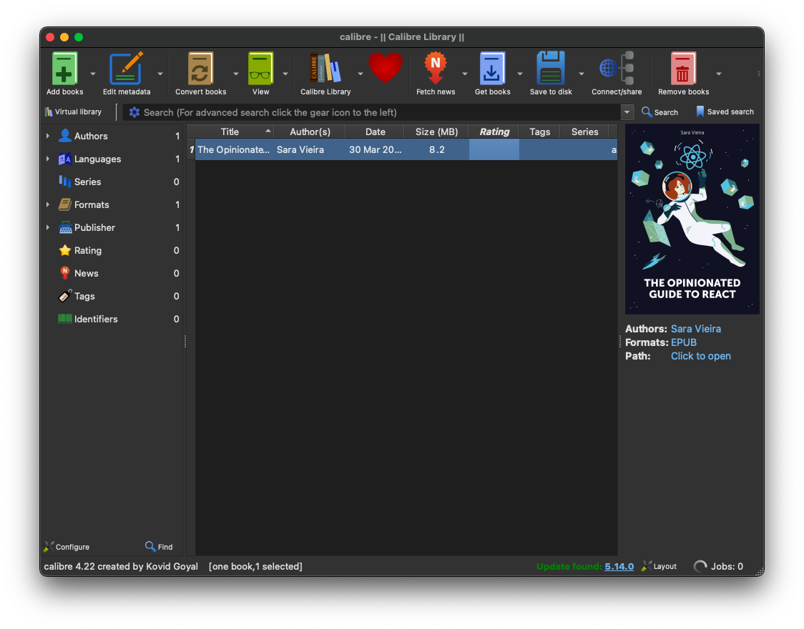
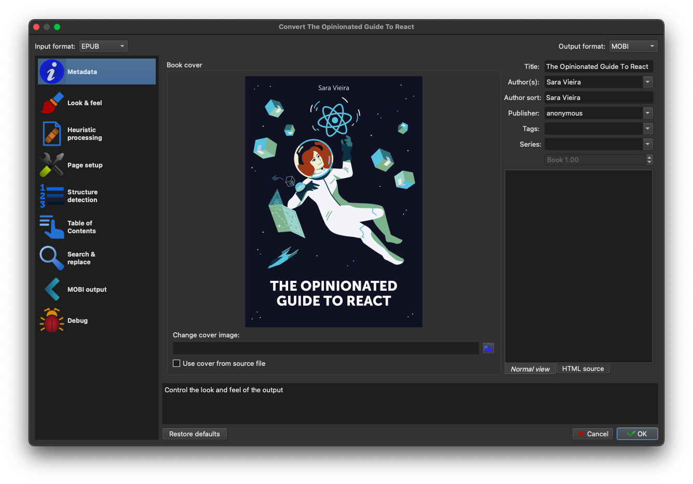
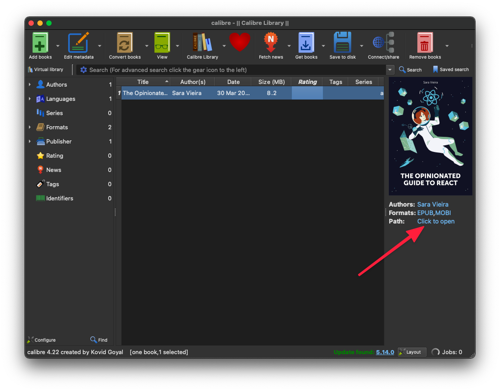

The starter will create EPUB and PDF files for you but not mobi files that are needed for Kindle devices.

I will share my process when it comes to adding these files.

I will be using a software called [Calibre](https://calibre-ebook.com/), it's free and available for all platforms.

Open the software and it should look something like this:

Create on "Add Books" and locate your EPUB file.

After this click on "Convert Books" and set the output format to Mobi like so:

This will return you to the homescreen of the app and tell you on job is in progress.

When its finished click on the link that says "Click to Open" in the path list item:

From here you can just copy the .mobi file to where you want to save it.
